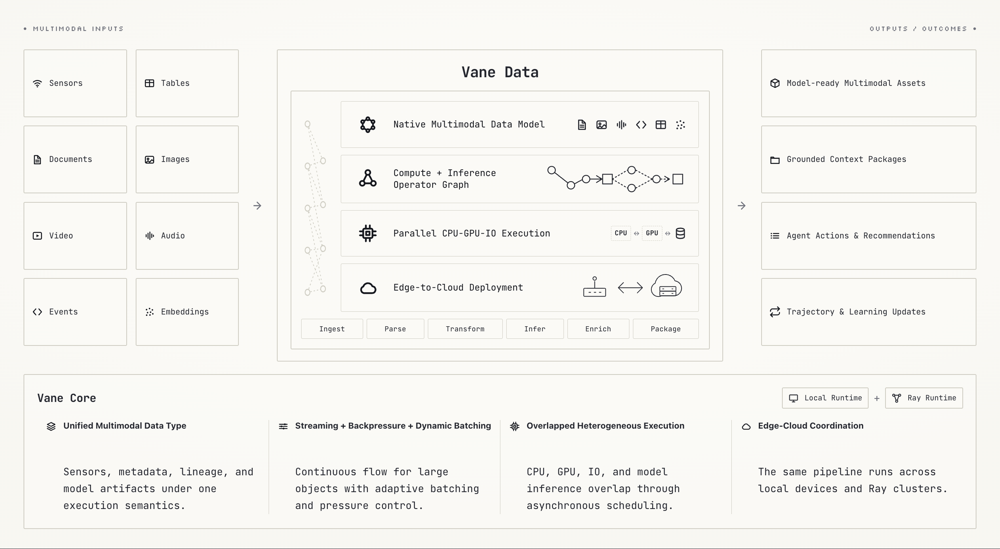
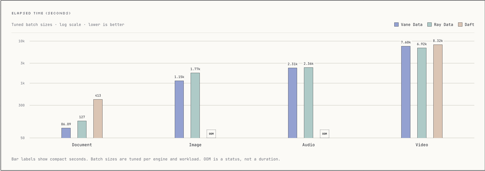

<h1 align="center">
  
</h1>

<p align="center">
  <strong>A high-performance, multimodal-native engine for AI workloads</strong>
</p>

<p align="center">
  <a href="https://pypi.org/project/vane-ai/">
    
  </a>
  <a href="LICENSE">
    
  </a>
  <a href="https://deepwiki.com/AstroVela/vane">
    
  </a>
</p>

<p align="center">
  <a href="https://discord.gg/BuKhPQcqs">
    
  </a>
  <a href="https://x.com/AstroVelaAI">
    
  </a>
</p>

## Vane Data

Vane Data is a high-performance, multimodal-native data engine for AI workloads. Built on a fork of [DuckDB](https://duckdb.org), it extends the core execution engine with native multimodal processing and a unified framework for local and distributed execution.



### Key Features

- **Multimodal-native processing** — Process images, video, audio, text, documents, events, sensor data, and tables through a unified type system. Dynamic batching and backpressure control handle variations in data size and computational cost.
- **Python and SQL interfaces** — Build data and AI pipelines with DuckDB SQL or the Python Relation API.
- **Built-in AI operations** — Invoke LLMs, generate embeddings, and run batch inference through OpenAI and Anthropic APIs or native vLLM integration. Prefix-aware bucketing improves vLLM prefix-cache hit rates and inference throughput.
- **Heterogeneous execution** — Overlap CPU, GPU, I/O, and model inference workloads through asynchronous scheduling.
- **Local-to-cloud execution** — Run native pipelines locally and supported analytical SELECTs across Ray clusters.
- **Designed for production AI workloads** — Build multimodal training-data preprocessing pipelines and enterprise-scale batch inference workflows.

---

## Getting Started

### Installation

Vane supports Python 3.10 through 3.14. Python 3.12 is recommended and is the primary development version.

Install the `vane-ai` package from PyPI:

```bash
pip install vane-ai
```
For more details, see the [Installation Guide](https://vane.astrovela.ai/docs/data/quickstart/installation).

### Quick Start

Follow the [Quickstart guide](https://vane.astrovela.ai/docs/data/quickstart/quickstart) to build and run your first Vane pipeline.

For encoded video intervals with synchronized audio and source timestamps, see
the [video clipping example](examples/video_clip.py). It covers `VideoFile.clip`,
the `video_clip` Python/SQL expression, output codecs, and resource limits.

### Execution backends

Connections run locally by default. Use `query()` for managed, streaming SELECT results:

```python
import vane

with vane.connect() as connection:
    with connection.query("SELECT range AS value FROM range(10)") as result:
        print(result.collect())
```

For distributed analytical SELECTs, initialize Ray and create a connection with
`backend="ray"`. Ray queries support pipelined execution and FTE with a registered
shared exchange store. Local SQL, Relation, model and DataSink APIs remain local.
See the [execution design and support matrix](PIPELINED_EXECUTION_DESIGN.md) for
configuration, ownership and unsupported operations. Global runner selection has
been removed; unsupported distributed queries fail explicitly.

Use a persistent server when clients should submit SQL without joining Ray:

```python
from vane.client import Client

with Client("grpc+tls://vane.example:8815", token=token, tls_root_certs=ca_pem) as client:
    with client.query("SELECT sum(range) FROM range(1000)") as result:
        print(result.collect())
```

Server startup, both TLS ports and session ownership are described in the
[server guide](SERVER_DESIGN.md). The [execution release matrix](EXECUTION_RELEASE.md)
defines this candidate's platforms, supported entry points and failure boundaries.

### More Resources

- [Examples](https://vane.astrovela.ai/docs/data/examples)
- [Production deployment](https://vane.astrovela.ai/docs/data/deploy/deployment)

---

## Multimodal Inference Benchmarks

Hardware configuration: 1 node, 36 CPU cores, 64 GB memory, and 1× NVIDIA GeForce RTX 2080 Ti (22 GB VRAM).

We use the [Ray Data benchmark suite](https://www.anyscale.com/blog/ray-data-daft-benchmarking-multimodal-ai-workloads) to compare Vane with Ray Data and Daft. The [benchmark source code](multimodal_inference_benchmarks) is included in this repository.



These historical benchmark results predate the execution cutover and describe single-node workloads. Performance acceptance for the new query runtimes is tracked in the [execution roadmap](PIPELINED_EXECUTION_ROADMAP.md).

See the [benchmarking page](https://vane.astrovela.ai/benchmarks) for detailed results.

---

## Contributing

Contributions and collaborations are welcome. Contribution guidelines and community channels will be published as the project opens further.

---

## License

Vane is distributed under the Apache License 2.0. See [LICENSE](LICENSE) and [NOTICE](NOTICE) for details and third-party attributions.

---

## Acknowledgements

Vane Data is built on top of DuckDB and inspired by infrastructure systems such as Ray Data, Daft, and Trino.
*   **[DuckDB](https://github.com/duckdb/duckdb)**: The core modular architecture and inspiration. A high-performance analytical database system. It is designed to be fast, reliable, portable, and easy to use.
*   **[DuckDB-Python](https://github.com/duckdb/duckdb-python)**: The core modular architecture and inspiration. The DuckDB Python package.
*   **[Ray Data](https://github.com/ray-project/ray)**: A scalable data processing library for AI workloads built on Ray
*   **[Daft](https://github.com/eventual-inc/daft)**: High-Performance Data Engine for AI and Multimodal Workloads
*   **[Trino](https://github.com/trinodb/trino)**: A fast distributed SQL query engine for big data analytics.

**Special thanks to these projects.**

---

<div align="center">

**Give Vane a ⭐️ if it helps you!**

</div>
