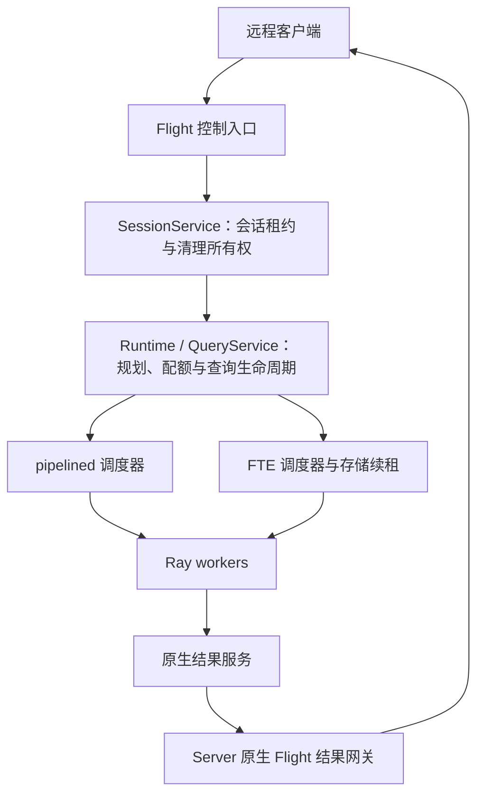

# Vane 独立服务与 Flight 接入

状态：P5.2.4a / b 已完成实现与相关验证。P5.2.4c 完整故障验收未完成。

## 协议选择与服务边界

本阶段使用 Arrow Flight。`DoAction` 承载有界控制消息，结果使用原生 `DoGet`、序号和 ACK。它是 Vane 的 Flight 协议，不宣称兼容 Flight SQL。运行服务不会改变 local / ray 或 pipelined / FTE 的选择规则。



`SessionService` 不依赖 Flight、gRPC、JSON、ticket 或 Quack。它只管理服务实例、会话、期限和清理所有者。Flight 层负责线格式、鉴权、参数校验与错误映射。已有 Runtime 继续拥有全局准入、worker 池、结果 actor 与存储；会话关闭保留其他会话所使用的共享服务。

未来升级 DuckDB 2.0 时，可以用 Quack 替换对外入口。DuckDB 官方计划在 2.0 中将 Quack 升至 1.0，并通过 `CONNECT` 路由远程 SQL，见 [2.0 预览](https://www.duckdb.org/2026/08/17/duckdb-20-highlights)及[开发版说明](https://www.duckdb.org/2026/09/02/try-duckdb-20-alpha)。这不是只换监听端口：[检查的 Quack 源码](https://github.com/duckdb/duckdb-quack/blob/f964cece8ecfe9006a607aa0a3e9b9030296c54f/src/quack_server.cpp)在 `DriveQuery` 中直接执行 `Connection::Query()`，需要把该执行入口、结果生产、取消和断连映射到 Vane 的服务核心。

这项迁移不要求替换 worker 之间的原生 Flight exchange，也不要求重写两种调度器。届时按升级后的 DuckDB 源码构建和验证 Quack，迁移客户端协议；不预先实现第二套协议、通用插件系统、双协议兼容或自动回退。本次不升级 DuckDB。

## 所有权与部署

- 一个 Server 进程独占一个 Runtime。数据库位置、原生配置、Ray 总预算与 exchange store 由服务端配置，客户端不能提交文件路径或任意原生配置。
- 每次启动生成新的 `server_id`。每次打开会话生成不可预测的 `session_id`；两个标识共同构成控制句柄。标识永不复用。
- 一个会话持有一个 RayQueryRuntime，后者持有原生根连接、全部 native cursors 和查询。会话数包含正在打开、正在关闭和清理失败的记录。
- 打开会话按需建立本进程内的服务核心，不启动 Ray actor。CLI 在监听前通过 `--ray-address` 连接已配置的 Ray 集群；默认 `auto`，显式 `local` 可以启动本机集群。嵌入式 `Server` 由宿主初始化 Ray。客户端不连接 Ray。
- 当前会话没有共享全局默认连接。`:memory:` 按会话建立独立数据库；指定同一文件时沿用原生数据库实例缓存。临时表等 DuckDB session 状态由其原生连接隔离；分布式 SQL 支持范围仍由 fragment compiler 决定。

公开启动方式为 `vane-server` 或 `python -m vane.server`。监听构造成功后开始接受 RPC；不需要每次查询启动进程。

```bash
python -m vane.server \
  --host 127.0.0.1 --port 8815 --result-port 8816 \
  --ray-address auto \
  --token-file /run/secrets/vane-token \
  --database /data/vane.db \
  --max-sessions 64 --lease-seconds 60
```

令牌文件由部署方提供，内容为 32–4096 个可打印 ASCII 字符。CLI 从文件读取，不在输出中打印令牌。默认监听回环地址；监听其他地址需要 `--tls-cert` 与 `--tls-key`。Python `Server(...)` 接受 PEM 证书/私钥字节对，使用 Arrow Flight 的 TLS 实现。

启动输出包含实际监听地址、`server_id` 和会话容量。SIGINT / SIGTERM 触发关闭；清理尚未成功时进程保留所有者并继续重试。客户端只通过协议使用会话，不获得 Python 连接对象。

## 第一阶段：会话控制协议

控制端口的所有 Flight 方法都要求 `authorization: Bearer <token>`，包括能力发现和未实现的方法。令牌在中间件中做常量时间比较。当前是持有同一凭据的受信客户端模型；`session_id` 也是敏感句柄，能力发现不返回其他会话标识。本阶段没有多租户用户体系。

Action body 是 UTF-8 JSON 对象，上限 64 KiB，要求 `"protocol": 1`。未知字段、重复字段、未知版本、非有限数字、非法资源声明均拒绝；不反序列化 pickle 或客户端 Python 对象。

| Action | 其他请求字段 | 返回内容 |
| --- | --- | --- |
| `vane.info` | 无 | server_id、READY/DRAINING/CLOSED、会话总量与关闭数量、容量、capabilities |
| `vane.session.open` | 可选 execution、resources | server_id、session_id、lease_seconds、OPEN |
| `vane.session.renew` | server_id、session_id | 相同句柄与新的 lease_seconds |
| `vane.session.close` | server_id、session_id | CLOSING 或 CLOSED |

`execution` 只能是 pipelined / fte；FTE 要求服务端预先注册 exchange store。resources 只接受 QueryResources 的会话限额，且不得超过 Runtime 总量。`Server` 的 `capabilities` 为 `sessions`、`queries`、`native-results`；仅构造会话核心而未配置网关时，只声明 `sessions`。

成功响应为 `{"protocol":1,"ok":true,"result":{...}}`。领域错误为 `{"protocol":1,"ok":false,"error":{"code":"...","message":"..."}}`，包括 SESSION_CAPACITY、SESSION_EXPIRED、SERVER_CLOSING、SERVER_CHANGED。请求格式错误使用 ArrowInvalid；鉴权失败使用 FlightUnauthenticatedError。调用方必须检查 `ok`；收到 RPC 回执本身不代表操作成功。

租约使用服务端单调时钟。lease_seconds 是续租间隔预算，不跨机器传递 monotonic 时间戳；客户端宜在间隔三分之一处续租，并从发送请求时保守计算。租约在进入连接创建前开始计时；创建本身超过期限也要清理。已经过期或开始关闭的会话无法被迟到心跳恢复。

打开操作不做自动重放。回执丢失时，RPC 取消检查或服务端租约负责回收未知会话，容量上限仍覆盖它。此阶段无需为已结束会话累积永久 request tombstone。Renew 可以在未过期时重试；Close 可以反复调用。不同 server_id 的任何控制请求均拒绝，不能把服务重启误认为旧会话已恢复。

Close 的 CLOSING 仅表示已封闭会话并接受清理。只有原生查询、cursor、数据库引用全部关闭且 Runtime 注销会话后，才返回 CLOSED 并释放会话槽位。客户端以同一句柄继续 Close 直到 CLOSED；已清理的句柄返回 CLOSED。服务端不复用句柄，因此无需保留全部历史关闭记录。

## 并发与失败收尾

创建连接前先注册 OPENING 所有者，创建本身在注册表锁之外运行。服务专用 Runtime 在 `_new_session` 返回时立即将原生会话 owner 记入当前打开记录，早于 native connection 的创建；即使连接创建及其回滚均失败，维护线程仍能重试该 owner。并发打开通过调用上下文关联自己的记录。Server 关闭或租约过期时封闭该记录；迟到的创建只能交给清理，不会重新发布 OPEN。

维护线程只检查状态和租约。每个关闭中的会话最多有一个清理线程，总数受 max_sessions 约束；任何清理都不持有会话注册表锁。失败记录保留原 RayQueryRuntime，而非重新读取可能已关闭的 connection.query_runtime。这样即使释放已生效但确认失败，下一次调用仍能确认完成。一次原生 close 阻塞时，其他会话的续租与清理仍可推进。

Server.close 从入口建立截止时间，立即禁止新会话，等待各会话清理，再关闭 Runtime 与 Flight listener。等待超时向调用方抛 TimeoutError，后台已有清理继续归属该 Server。重试等待同一进行中的动作，不能并行关闭相同资源。Flight shutdown 不在 RPC handler 中调用，并由唯一关闭线程等待活动 RPC 退出。

Runtime 的 worker / result 清理继续使用新的 release RPC，保留暂时失联的所有者；不重新等待永久失败的 ObjectRef。FTE watchdog、源快照与存储租约沿用现有协议。

## 第二阶段：远程查询与原生结果

已增加 `vane.query.execute/status/cancel/finish/close`，以及 `vane.client.Client`。规划、协调器、状态监控和 FTE 续租在 Server 进程内运行。控制消息只传 SQL、`QueryExecutionOptions.to_dict()`、rows_per_batch 与身份；SQL 参数暂未进入分布式编译器支持范围。

### 提交与所有权

- Execute 字段为 server_id、session_id、sequence、sql，可选 options、rows_per_batch。会话从 sequence=1 开始，按连续整数提交；必须先确认一个提交已接收，再提交下一个。已接收的序号对应同一 SQL/options 摘要，重试只返回原记录；不同内容报 SUBMISSION_CONFLICT。
- 会话保存最高已接收序号。清理并关闭的旧序号报 QUERY_RETIRED，不能重新执行；无需无限累积历史 tombstone。Server 以 `SessionLimits.max_query_handles` 限制全部会话中保留的查询记录，默认 128。终态记录也计费，调用方必须 CloseQuery 或关闭会话。
- Execute 在启动查询线程前登记所有者。每条查询使用独立 native cursor，状态为 PREPARING、READY、SUCCEEDED、FAILED 或 CANCELED；`cleaned` 单独表示清理已确认。Status 只读取缓存元数据，不等待规划锁、pump 或远端 RPC。
- Cancel/CloseQuery 只设置命令，查询所有者推进中断和清理。两个线程分别负责查询与中断，数量受查询记录上限约束。会话关闭等待所有查询的 native cursor、结果、worker 与 FTE lease 清理，再注销会话。
- 准入、执行和交付期限沿用 QueryContext/QueryResult。错误响应保留 CANCELLED、ADMISSION_TIMEOUT、EXECUTION_TIMEOUT、DELIVERY_TIMEOUT；客户端还原对应异常类。暂时 RPC 失败不会把查询当成已清理。

### 原生结果链路

`NativeResultConsumer` 是两种调度器的显式结果接入对象。嵌入式调用在本进程读取其 channel；Server 将该 channel 发布在共享的原生结果网关。网关自身不订阅第二条相同流，也没有 Python batch 转发循环：

```text
worker/result actor → native subscriber → bounded channel → native public Flight → native client
```

网关固定监听 `--result-port`，与控制端口同处 Server 主机；`--advertise-host` 指定客户端可达主机名。绑定通配地址必须配置该主机名。两个端口均使用 Flight 自带 TLS，非回环监听需要证书。客户端为两个连接验证证书和主机名；TLS 控制通道不替代结果通道加密。当前受信 Ray 网络内的内部 exchange 保持现有传输。

READY 返回网关地址、随机查询 capability、原生 schema/列名、engine identity、帧与窗口上限；不暴露 Ray 私网端点或内部 ticket。结果只允许一次订阅，不能透明重放。此阶段原生客户端必须与 Server 使用相同 engine identity，校验发生在解析原生 schema 之前。SQL 最多 32 KiB，控制请求/响应最多 64 KiB，结果 descriptor 最多 60 KiB。

共享网关的端点数受 Runtime.max_results 限制，每个端点预留一个原生发送 staging；查询另持有一个原生接收 staging 和一个窗口。网关每查询上界为 `window_bytes + 2 * DirectFlight.staging_per_link(frame_bytes)`，乘以 max_results 得到服务进程结果传输上界；它与 worker/result actor 预算分别计费。Revoke 先封闭端点并等待已进入的流退出，再归还端点容量；阻塞或失败保留旧端点和清理所有权，不影响其他查询。

客户端另外配置 `ResultDeliveryLimits`，限制结果数及交付 Arrow 视图的字节预算；每个活跃结果另有声明的原生接收窗口和 staging。导出的 Arrow 切片继续计费，`collect()` 逐批复制到调用方内存。状态监控独立于读取线程，远端取消/超时可以唤醒因持有旧视图而等待预算的消费者。

EOF 不是提交完成回执。客户端原生接收端验证序号、ACK、FINISH；读完本地窗口后发送 FinishQuery。服务端检查网关已发 FINISH、全部帧已 ACK、所有生产任务完成以及持久错误，再提交交付完成状态。清理失败保留 SUCCEEDED 与 `cleaned=false`；清理完成前结果和查询配额仍持有。取消与交付完成通过已有 context/result 锁仲裁。

### 客户端使用

```python
from vane.client import Client

with Client("grpc+tls://vane.example:8815", token=token, tls_root_certs=ca_pem) as client:
    with client.query("SELECT sum(range) FROM range(1000000)") as result:
        table = result.collect()
```

`client.submit(sql)` 返回 RemoteQuery，可调用 status/cancel/result/close。执行回执丢失时，Client 保留相同序号和 SQL；后续提交先重新确认该提交，绝不自动生成另一查询。Client 定期续租；close 超时可以重试。客户端无法恢复已断开的数据流，跨进程故障矩阵已在 P5.2.4c 完成单机验收。

## 第三阶段：故障验收与迁移准备

- 杀客户端、取消正在创建的会话、丢弃 Execute 回执、停止心跳，验证无孤儿会话、查询、worker context 或 store lease。
- 慢客户端、结果服务丢失、worker 暂时不可达和永久死亡，验证错误保留、有限内存、配额隔离与清理重试。
- Server 重启产生新 server_id；旧句柄明确失败。本阶段不提供跨 Server 重启恢复 Session 或透明重放 SQL。
- 混跑 pipelined / FTE，通过同一 worker 的实际资源占用区间检查并发；这证明同时占用已准入资源，不等同于 CPU 同时执行。基准显式区分 Runtime 与 Flight，后者使用同进程回环客户端，两种入口共享同一数据集、预算和正确性检查。历史 Flight 超时仍需独立定位。
- DuckDB 2.0 升级时，针对 Quack 原生 SQL 执行、结果编码、取消和断连做专项集成，复用本设计的服务所有权测试；协议替换不承担旧客户端兼容或 fallback。

完整故障矩阵、单机部署验收边界与复现命令见[执行验收](EXECUTION_ACCEPTANCE.md#remote-server-acceptance)。性能对照命令见[执行基准](EXECUTION_BENCHMARKS.md#shared-runtime-and-flight-comparison)。真实网络分区、多机部署、Server 被强杀后的运维恢复及跨平台 release gate 不属于本轮单机验证；Server 重启后旧身份失效，不自动重放。

## 验证顺序

每次实现先审查修改，连续两轮无问题后，再做一次非 editable 安装和相关测试。Python 改动不重编 native。验证覆盖 SessionService、Flight 控制/鉴权、原生传输、独立客户端/CLI、数据库锁、两种 Ray 模式及结果资源生命周期；不运行完整 release / fast 套件。测试和设计文件加入源码包与 release gate。

第二阶段相关验证共 **270 passed、1 skipped**：非 Ray 203、真实 Ray 66、独立 CLI 1；跳过项需要可选 ADBC。连续两轮审查后完成一次 native 增量 Release 构建。首次执行修正了超时测试中的不支持 SQL，以及 Ray 初始化覆盖 CLI 信号处理的问题；修正再审查两轮后只重新打包 Python，native 哈希不变，复跑失败及未运行用例均通过。

第三阶段相关验证共 **170 passed、1 skipped**：非 Ray 122、共享 Ray 45、独立 CLI 3；跳过项仍为可选 ADBC。先连续两轮审查，再做一次非 editable 打包安装及相关测试；native 哈希不变，没有 C++ 修改。两种入口的三次重复、两组容量实测共完成 224 个计时样本、32 项完整结果校验与 12 次 worker 故障恢复。混跑以共享 worker 的资源占用重叠验收，所有检查通过。方法、实际数值和单机范围见[基准记录](EXECUTION_BENCHMARKS.md#shared-service-and-flight-measurements-2026-10-08)。
