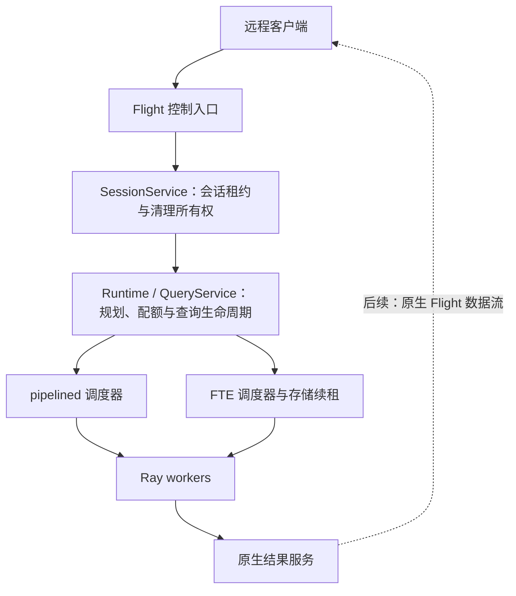

# Vane 独立服务与 Flight 接入

状态：P5.2.4 的分阶段设计。当前实现会话控制；远程 SQL、远程结果读取与完整故障验收尚未交付。

## 协议选择与服务边界

本阶段使用 Arrow Flight。`DoAction` 承载有界控制消息，后续结果使用原生 `DoGet`、序号和 ACK。它是 Vane 的 Flight 协议，不宣称兼容 Flight SQL。运行服务不会改变 local / ray 或 pipelined / FTE 的选择规则。



`SessionService` 不依赖 Flight、gRPC、JSON、ticket 或 Quack。它只管理服务实例、会话、期限和清理所有者。Flight 层负责线格式、鉴权、参数校验与错误映射。已有 Runtime 继续拥有全局准入、worker 池、结果 actor 与存储；会话关闭保留其他会话所使用的共享服务。

未来升级 DuckDB 2.0 时，可以用 Quack 替换对外入口。DuckDB 官方计划在 2.0 中将 Quack 升至 1.0，并通过 `CONNECT` 路由远程 SQL，见 [2.0 预览](https://www.duckdb.org/2026/08/17/duckdb-20-highlights)及[开发版说明](https://www.duckdb.org/2026/09/02/try-duckdb-20-alpha)。这不是只换监听端口：[检查的 Quack 源码](https://github.com/duckdb/duckdb-quack/blob/f964cece8ecfe9006a607aa0a3e9b9030296c54f/src/quack_server.cpp)在 `DriveQuery` 中直接执行 `Connection::Query()`，需要把该执行入口、结果生产、取消和断连映射到 Vane 的服务核心。

这项迁移不要求替换 worker 之间的原生 Flight exchange，也不要求重写两种调度器。届时按升级后的 DuckDB 源码构建和验证 Quack，迁移客户端协议；不预先实现第二套协议、通用插件系统、双协议兼容或自动回退。本次不升级 DuckDB。

## 所有权与部署

- 一个 Server 进程独占一个 Runtime。数据库位置、原生配置、Ray 总预算与 exchange store 由服务端配置，客户端不能提交文件路径或任意原生配置。
- 每次启动生成新的 `server_id`。每次打开会话生成不可预测的 `session_id`；两个标识共同构成控制句柄。标识永不复用。
- 一个会话持有一个 RayQueryRuntime，后者持有原生根连接、全部 native cursors 和查询。会话数包含正在打开、正在关闭和清理失败的记录。
- 打开会话按需建立本进程内的服务核心，不启动 Ray actor。本阶段 CLI 不初始化 Ray；远程查询阶段将在服务端连接已配置的 Ray 集群，客户端不连接 Ray。
- 当前会话没有共享全局默认连接。`:memory:` 按会话建立独立数据库；指定同一文件时沿用原生数据库实例缓存。临时表等 DuckDB session 状态由其原生连接隔离；分布式 SQL 支持范围仍由 fragment compiler 决定。

公开启动方式为 `vane-server` 或 `python -m vane.server`。监听构造成功后开始接受 RPC；不需要每次查询启动进程。

```bash
python -m vane.server \
  --host 127.0.0.1 --port 8815 \
  --token-file /run/secrets/vane-token \
  --database /data/vane.db \
  --max-sessions 64 --lease-seconds 60
```

令牌文件由部署方提供，内容为 32–4096 个可打印 ASCII 字符。CLI 从文件读取，不在输出中打印令牌。默认监听回环地址；监听其他地址需要 `--tls-cert` 与 `--tls-key`。Python `Server(...)` 接受 PEM 证书/私钥字节对，使用 Arrow Flight 的 TLS 实现。

启动输出包含实际监听地址、`server_id` 和会话容量。SIGINT / SIGTERM 触发关闭；清理尚未成功时进程保留所有者并继续重试。客户端只通过协议使用会话，不获得 Python 连接对象。

## 第一阶段：会话控制协议

所有 Flight 方法都要求 `authorization: Bearer <token>`，包括能力发现和未实现的方法。令牌在中间件中做常量时间比较。当前是持有同一凭据的受信客户端模型；`session_id` 也是敏感句柄，能力发现不返回其他会话标识。本阶段没有多租户用户体系。

Action body 是 UTF-8 JSON 对象，上限 64 KiB，要求 `"protocol": 1`。未知字段、重复字段、未知版本、非有限数字、非法资源声明均拒绝；不反序列化 pickle 或客户端 Python 对象。

| Action | 其他请求字段 | 返回内容 |
| --- | --- | --- |
| `vane.info` | 无 | server_id、READY/DRAINING/CLOSED、会话总量与关闭数量、容量、capabilities |
| `vane.session.open` | 可选 execution、resources | server_id、session_id、lease_seconds、OPEN |
| `vane.session.renew` | server_id、session_id | 相同句柄与新的 lease_seconds |
| `vane.session.close` | server_id、session_id | CLOSING 或 CLOSED |

`execution` 只能是 pipelined / fte；FTE 要求服务端预先注册 exchange store。resources 只接受 QueryResources 的会话限额，且不得超过 Runtime 总量。第一阶段 `capabilities` 只有 `sessions`，客户端不能据此认为已支持远程查询。

成功响应为 `{"protocol":1,"ok":true,"result":{...}}`。领域错误为 `{"protocol":1,"ok":false,"error":{"code":"...","message":"..."}}`，包括 SESSION_CAPACITY、SESSION_EXPIRED、SERVER_CLOSING、SERVER_CHANGED。请求格式错误使用 ArrowInvalid；鉴权失败使用 FlightUnauthenticatedError。调用方必须检查 `ok`；收到 RPC 回执本身不代表操作成功。

租约使用服务端单调时钟。lease_seconds 是续租间隔预算，不跨机器传递 monotonic 时间戳；客户端宜在间隔三分之一处续租，并从发送请求时保守计算。租约在进入连接创建前开始计时；创建本身超过期限也要清理。已经过期或开始关闭的会话无法被迟到心跳恢复。

打开操作不做自动重放。回执丢失时，RPC 取消检查或服务端租约负责回收未知会话，容量上限仍覆盖它。此阶段无需为已结束会话累积永久 request tombstone。Renew 可以在未过期时重试；Close 可以反复调用。不同 server_id 的任何控制请求均拒绝，不能把服务重启误认为旧会话已恢复。

Close 的 CLOSING 仅表示已封闭会话并接受清理。只有原生查询、cursor、数据库引用全部关闭且 Runtime 注销会话后，才返回 CLOSED 并释放会话槽位。客户端以同一句柄继续 Close 直到 CLOSED；已清理的句柄返回 CLOSED。服务端不复用句柄，因此无需保留全部历史关闭记录。

## 并发与失败收尾

创建连接前先注册 OPENING 所有者，创建本身在注册表锁之外运行。服务专用 Runtime 在 `_new_session` 返回时立即将原生会话 owner 记入当前打开记录，早于 native connection 的创建；即使连接创建及其回滚均失败，维护线程仍能重试该 owner。并发打开通过调用上下文关联自己的记录。Server 关闭或租约过期时封闭该记录；迟到的创建只能交给清理，不会重新发布 OPEN。

维护线程只检查状态和租约。每个关闭中的会话最多有一个清理线程，总数受 max_sessions 约束；任何清理都不持有会话注册表锁。失败记录保留原 RayQueryRuntime，而非重新读取可能已关闭的 connection.query_runtime。这样即使释放已生效但确认失败，下一次调用仍能确认完成。一次原生 close 阻塞时，其他会话的续租与清理仍可推进。

Server.close 从入口建立截止时间，立即禁止新会话，等待各会话清理，再关闭 Runtime 与 Flight listener。等待超时向调用方抛 TimeoutError，后台已有清理继续归属该 Server。重试等待同一进行中的动作，不能并行关闭相同资源。Flight shutdown 不在 RPC handler 中调用，并由唯一关闭线程等待活动 RPC 退出。

Runtime 的 worker / result 清理继续使用新的 release RPC，保留暂时失联的所有者；不重新等待永久失败的 ObjectRef。FTE watchdog、源快照与存储租约沿用现有协议。

## 第二阶段：远程查询与原生结果

下一 PR 增加 Execute、Status、Cancel、CloseQuery，以及独立客户端。规划、协调器、状态监控和 FTE 续租在 Server 进程内运行。控制请求只传 SQL、明确支持的 options、会话和查询句柄，不发送运行中的 Python 对象。

1. Execute 先在会话中注册查询所有者，返回查询身份和状态；同一提交身份的重试不能重复执行。查询记录随 Session 关闭或租约到期收尾。
2. SQL 编译、准入与执行在服务端推进。排队时间属于 admission deadline；执行期限从实际获得执行资源开始；生产结束后的消费属于 delivery deadline。
3. 将当前调度器中硬编码的本地客户端订阅移到明确的结果消费者接入步骤。服务端不能先订阅，再让远程客户端重复订阅同一条不可重放流。
4. 为远程结果返回可达的原生 Flight endpoint 与绑定查询身份的 capability。客户端原生接收端处理有界窗口、类型转换、序号、ACK 和 FINISH；Python 控制 Server 不读取或重新转发 RecordBatch。
5. 公网/代理部署需要结果端点的可达地址和 TLS，控制连接的 TLS 不自动保护内部或结果端点。这是第二阶段的交付条件，不能只返回 Ray 节点私网地址就宣称完整远程服务可用。
6. 服务端继续持有查询配额、结果上下文和清理所有权，直到结果完成关闭；客户端视图持有的本地内存由客户端预算独立计费。EOF 仍需检查持久错误，取消和超时保持类型。

第一阶段没有提供伪装为 QueryResult 的控制对象，也没有把当前 scheduler.read_next_batch 包成 Python 网络转发循环。第二阶段将明确结果 endpoint、远程 QueryResult 所有权和交付完成确认后再扩展能力声明。

## 第三阶段：故障验收与迁移准备

- 杀客户端、取消正在创建的会话、丢弃 Execute 回执、停止心跳，验证无孤儿会话、查询、worker context 或 store lease。
- 慢客户端、结果服务丢失、worker 暂时不可达和永久死亡，验证错误保留、有限内存、配额隔离与清理重试。
- Server 重启产生新 server_id；旧句柄明确失败。本阶段不提供跨 Server 重启恢复 Session 或透明重放 SQL。
- 混跑 pipelined / FTE，通过实际 worker 执行区间检查并发；更新当前 Runtime 的基准。历史 Flight 超时仍需独立定位。
- DuckDB 2.0 升级时，针对 Quack 原生 SQL 执行、结果编码、取消和断连做专项集成，复用本设计的服务所有权测试；协议替换不承担旧客户端兼容或 fallback。

## 验证顺序

每次实现先审查修改，连续两轮无问题后，再做一次非 editable 安装和相关测试。Python 改动不重编 native。第一阶段运行 SessionService、真实 Flight 控制/鉴权、独立进程与数据库锁回归；不运行完整 release / fast 套件。测试和设计文件加入源码包与 release gate。
